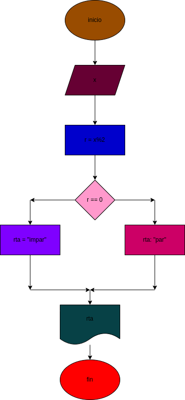

# Ejercico #4
## poder diferenciar si un numero es par o impar

# ANALISIS
Variables de entrada(imput)
X: Un numero que puede ser par o puede ser impar

variabe de proceso y salida (processing,storage, output)
r = X % 2 sera lo que sacara el modulo del numero entre 2 
r == 0 sera lo que utilizara para calcular si el numero es par o impar

# DISEÑO

